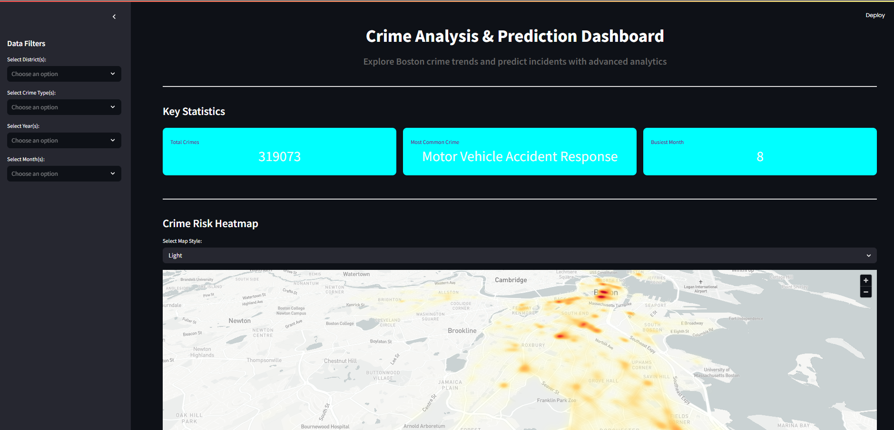

#Rakshekanetra: Smart Crime Analytics Dashboard

A real-time crime analytics dashboard built for hackathon use by the Karnataka Police. Integrates machine learning, Streamlit, Google Maps API, and dashboard visualizations to support smart policing.

---

## Features

-  Crime trend analysis using machine learning  
-  Real-time map with Google Maps API  
-  Predictive analytics for hotspot detection  
-  Smart dashboard interface for field officers  
-  Streamlit-based interactive UI  

---

##  Tech Stack

- **Frontend:** Streamlit  
- **Backend:** Python  
- **APIs:** Google Maps API  
- **ML Libraries:** scikit-learn, pandas, numpy  
- **Visualization:** Plotly, Streamlit Charts  

---

##  Screenshot

---

